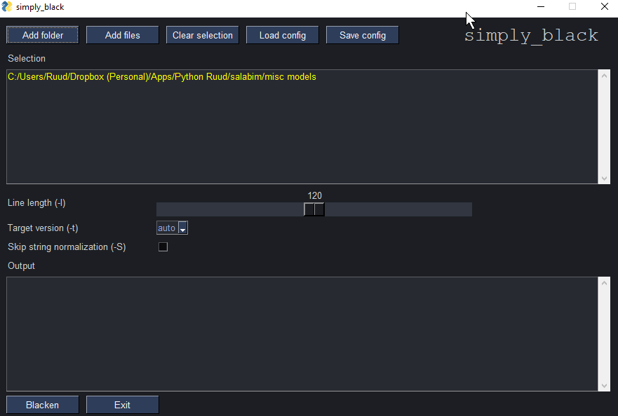
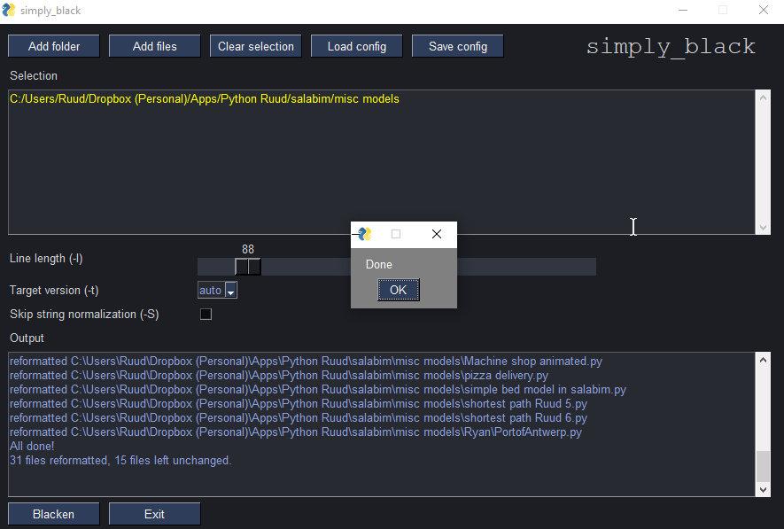

# simply_black
This package provides a GUI wrapper around the popular Black Python formatter.

So instead of a command line, the user can choose which files and/or folders
have to be formatted.

And the following options can be set in an easy way
- line length (-l)
- target platform (-t)
- skip string normalization (-S)

Configuration (settings and selected files/folders) can be saved to a json file, to
be used later.

The program loads the file simply_black.json upon startup, if available.

It is also possible to start simply_black with a given configuration file.

Installation
------------
The file simply_black.py can be downloaded from GitHub. This file requires MySimpleGUI and PySimpleGUI to be isntalled (both are available on GitHub or PyPI).

Alternatively, there's a file simply_black_embedded, which has the packages MySimpleGUI and PySimpleGUI embedded.

Requirements
------------
Python >= 3.6

For simply_black.py:
- MySimpleGUI, available from GitHub or PyPI
- PySimpleGUI, available from Github or PYPI

For simply_black_embedded.py:
- None

Usage
-----
The program simply_black.py has one optional parameter, the config json file.
If no parameter is given, the program tries to open the file *simply_black.json* from the current directory.
If the json file is not found, the selection will be empty, and the follwong defaults will apply:

- line length (-l): 88
- target platform (-t): auto
- skip string normalization (-S): off

On the top row you will find the following buttons:

- **Add folder**, to add folders to the selection panel 
- **Add files**, to add file(s) to the selection panel
- **Clear selection**, to clear the selection panel
- **Load config**, to load a previously stored json file
- **Save config**, to save the selection and the setting to a json file

Next, the **line length** can be changed with the slider between 80 and 255.

Next, the **target platform** can be chosen (auto, py27, py33, py34, py35, py36, py37, py38)

And finally, the **skip string normalization** can be enable by ticking the option fiels

At the bottom are two buttons:
 - **Blacken** which starts the actual Black program. Output will be shown in the output panel.
 - **Exit** to exit the program
 
The **Output** panel will show the result of the Black prorgram.

